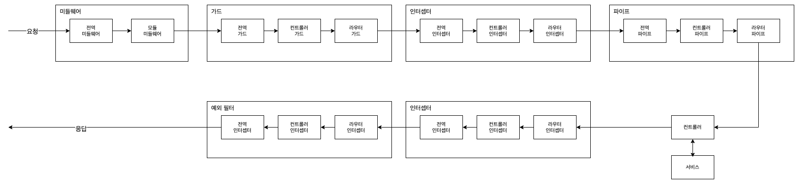

### 요청 / 응답 생명주기

들어온 요청이 어떤 컴포넌트를 거쳐서 처리되고, 생성된 응답은 또 어떤 컴포넌트를 거쳐 처리되는지를 말한다.
어떤 프레임워크를 사용하더라도 생명주기를 알아두는 것은 중요 -> 애플리케이션의 동작을 쉽게 이해할 수 있다.

### 미들웨어

미들웨어의 실행순서는 정해져있음

1. 전역으로 바인딩된 미들웨어를 실행
2. 모듈에 바인딩 되는 순서대로 실행
3. 다른 모듈에 바인딩되어 있는 미들웨어들이 있으면 먼저 루트 모듈에 바인딩 된 미들웨어를 실행하고, impotrs에 정의한 순서대로 실행

### 가드

전역으로 바인딩 된 가드를 먼저 시작하고, 컨트롤러에 저으이된 순서대로 실행
아래와 같은경우에는 Guard 1 -> 2 -> 3 순서

```ts
@UseGuards(Guard1, Guard2)
@Controller('users')
export class UsersController {
  constructor(private usersService: UsersService) {}

  @UseGuards(Guard3)
  @Get()
  getUsers(): Users[] {
    return this.usersService.getUsers();
  }
}
```

### 인터셉터

인터셉터의 실행순서는 가드와 유사하며, 한가지 알아야 할 점은 인터셉터는 RxJS의 Observable 객체를 반환하는데 이는 요청의 실행순서와 반대순서로 동작한다.

<b>즉, 요청은 전역 > 컨트롤러 > 라우터의 순서대로 동작하지만, 응답은 라우터 > 컨트롤러 > 전역으로 동작</b>

### 파이프

파이프가 여러 레벨에서 적용되어 있다면 이전과 마찬가지의 순서대로 적용합니다.
특이한 점은 파이프가 적용된 라우터의 매개변수들이 여러개 있을 때 정의한 순서의 거꾸로 적용한다.
다음 코드를 보면 파이프가 두개 적용되어 있습니다.
updateUser 함수에는 파이프가 둘 다 적용되는데 GeneralValidationPipe > RouteSpecificPipe 순으로 적용된다.
하지만 이들 파이프를 각각 적용하는 updateUser의 파라미터는 query > parmas > body의 순서대로 적용된다.

<b>즉 GeneralValidationPipe가 query > params > body의 순서대로 적용되고, 이후 RouteSpecificPipe가 같은 순서대로 적용된다.</b>

```ts
@UsePipes(GeneralValidationPipe)
@Controller('users')
export class UsersController {
  constructor(private usersService: UsersService) {}

  @UsePipes(RouteSpecificPipe)
  @Patch(':id')
  updateUser(
    @Body() body: UpdateUserDTO,
    @Param() params: UpdateUserParams,
    @Query() query: UpdateUserQuery,
  ) {
    return this.usersService.updateUser(body, params, query);
  }
}
```

### 예외 필터

유일하게 필터는 전역 필터가 먼저 적용되지 않는다.
라우터 > 컨트롤러 > 전역으로 바인딩된 순서대로 동작하며, 참고로 필터는 예외를 잡으면(catch) 다른 필터가 동일한 예외를 잡을 수 없다.
라우터에 적용된 예외 필터가 이미 예외를 잡아서 처리했는데 전역 예외 필터가 또 잡아서 처리르 할 필요가 없기 때문이다.

<br />

### 일반적인 요청 / 응답 생명주기


